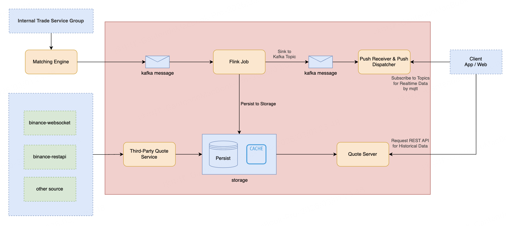

## 一、定位

> **这是一个以 Kafka + Flink 为核心的行情处理系统，支持多源行情接入、实时推送、历史数据查询，并与撮合引擎解耦。**

核心目标只有三个：

1. **实时行情低延迟推送**
2. **行情数据可回放、可补算**
3. **内部撮合行情与外部行情统一处理**

------

## 二、系统分层结构



### 1️⃣ Outer Market

- `binance-websocket`
- `binance-restapi`
- `other source`

**职责**

- 接入外部交易所行情
- WebSocket：实时 tick / trade / depth
- REST API：补历史、补断档

**设计意图**

- 外部行情 **不可信 / 不稳定**
- 必须和内部撮合行情 **解耦**
- 统一进入内部处理链路

------

### 2️⃣ Internal Trade Service Group

- **Matching Engine（撮合引擎）**

**职责**

- 内部订单撮合
- 产出 **权威成交、盘口变更事件**

**关键点**

- 撮合引擎 **不直接面对客户端**
- 只做一件事：**算交易**

这点非常正确。

------

## 三、核心处理链路

这一整块是 **Core Market Data Server Group**，是系统的心脏。

------

### 3️⃣ Kafka（事件解耦层）

你图里有两段 Kafka：

#### 第一段

```
Matching Engine
    ↓
Kafka Message
```

#### 第二段

```
Flink Job
    ↓
Kafka Topic
```

**Kafka 在这里承担 4 个角色：**

1. 解耦撮合与行情
2. 削峰填谷
3. 事件回放
4. Flink 的天然输入源

------

### 4️⃣ Flink Job（行情计算核心）

图中央：

**Flink Job**

#### 它在做什么？

- 消费 Kafka 中的：
  - 成交
  - 订单簿变更
  - 外部行情
- 计算：
  - K 线（1s / 1m / 5m）
  - 最新价
  - 成交统计
  - 深度快照
- 输出两条路：
  1. **实时行情**
  2. **持久化数据**

------

#### Flink 向下两条分支

##### 分支一：实时推送

```
Flink → Kafka Topic → Push System → Client
```

##### 分支二：落库

```
Flink → Persist Storage
```

这是**典型 Lambda / Kappa 风格**。

------

### 5️⃣ Push Receiver & Dispatcher（实时推送层）

右上角：

- 订阅 Kafka Topic
- 向客户端推送实时数据
- 使用 **MQTT / WebSocket**

**职责**

- 高并发连接管理
- 按 symbol / channel 分发
- 不做业务计算

👉 **推送层 = IO 密集型**
👉 **Flink = CPU / 状态密集型**

这个切分非常合理。

------

## 四、存储与查询链路

### 6️⃣ Storage（持久化 + 缓存）

中下部：

- **Persist**
  - 行情历史
  - K线
  - 成交记录
- **Cache**
  - 最新价
  - 最新 K 线
  - 最新深度

**特点**

- 写入方：Flink / Third-Party Quote Service
- 读取方：Quote Server

------

### 7️⃣ Third-Party Quote Service（外部行情服务）

```
Outer Market → Third-Party Quote Service → Storage
```

**作用**

- 专门负责：
  - 外部行情标准化
  - 清洗
  - 对齐内部结构
- 不直接推送给客户端

------

### 8️⃣ Quote Server（行情服务）

- 对外提供 **REST API**
- 查询：
  - K线
  - 历史成交
  - 历史行情

**为什么不用 Kafka？**

- Kafka 是 **流**
- 历史查询是 **随机读**
- 用 REST + DB / Cache 是正确选择

------

## 五、客户端视角的数据通路

### 客户端有两条通路：

#### 1️⃣ 实时行情

```
Client
  ← MQTT / WS ← Push Dispatcher ← Kafka ← Flink
```

特点：

- 超低延迟
- 不保证完整性
- 可丢、可重连

#### 2️⃣ 历史行情

```
Client → REST → Quote Server → Storage
```

特点：

- 强一致
- 可分页
- 可回放

------

## 六、工程评价

### 优点

1. 撮合与行情彻底解耦
2. Kafka + Flink 结构非常正统
3. 实时 / 历史分离
4. 外部行情隔离得很好
5. 可扩展性强（加 symbol、加源都容易）

### 潜在风险

1. **Flink 状态一致性**
   - Checkpoint / Exactly-once 必须配置好
2. **Kafka Topic 设计**
   - symbol 粒度
   - 分区策略
3. **行情乱序 / 延迟**
   - watermark
   - out-of-order
4. **Push 层背压**
   - 客户端慢 ≠ Kafka 慢