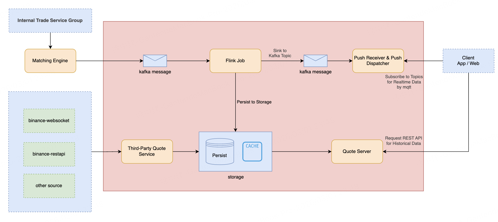

# 一、整体架构分层

这是一个**交易所实时行情系统（Market Data / Quote System）整体架构图**，主要包含撮合数据流、外部行情接入、实时推送以及历史查询四条主线。下面我按模块和数据流方向做一个结构化说明。

整个红色区域代表 **行情系统核心域**，主要分为三层：

1. **数据生产层（Data Producer）**
2. **数据处理与存储层（Processing & Storage）**
3. **数据分发层（Distribution Layer）**

系统同时支持：

* 内部撮合数据（自有交易所）
* 外部行情数据（如 Binance）
* 实时推送（MQTT）
* 历史查询（REST API）

---

# 二、内部撮合数据链路（实时行情主链路）

## 1、Matching Engine → Kafka

* 内部交易服务组（Internal Trade Service Group）
* 撮合引擎（Matching Engine）
* 将成交、盘口等数据写入 **Kafka Topic**

这是系统的核心数据源。

---

## 2、Kafka → Flink Job

* Flink 消费撮合产生的 Kafka 消息
* 执行流式计算任务，例如：

  * 生成 K 线（1m / 5m / 1h）
  * 聚合 ticker
  * 计算 24h 统计
  * 盘口深度合并

Flink 在这里承担 **流式计算引擎** 的角色。

---

## 3、Flink 输出两条路径

### A. 实时推送路径

Flink → Kafka → Push Receiver & Dispatcher

说明：

* Flink 计算完成后再次写入 Kafka
* Push 服务订阅这些 Topic
* 客户端通过 MQTT 订阅实时数据

客户端（Client App / Web）：

* 通过 MQTT 订阅指定 Topic
* 获取实时行情数据

👉 这是低延迟实时推送链路。

### B. 存储路径：缓存

Flink → Redis Cache

Flink 将热点数据写入 Redis 缓存：

* 最新 ticker（实时价格快照）
* 当前盘口深度（买卖挂单）
* 最近成交记录

缓存特点：

* 毫秒级读取延迟
* 支持高并发访问
* 数据有过期策略，保留最新状态

👉 主要用于 REST API 查询最新行情数据。

### C. 存储路径：持久化

Flink → Persistent Storage（MySQL / ClickHouse）

Flink 将历史数据写入持久化存储：

* K 线数据（1m / 5m / 15m / 1h / 4h / 1d）
* 历史成交记录
* 历史 ticker 快照

持久化特点：

* 支持时间范围查询
* 支持分页与聚合统计
* 数据永久保留，用于历史回溯

👉 主要用于历史 K 线查询、数据分析与报表生成。

---

# 三、外部行情接入链路（第三方行情）

左侧蓝色区域表示外部行情源：

* binance-websocket
* binance-restapi
* other source

流程如下：

外部行情 → Third-Party Quote Service → Storage

第三方行情服务负责：

* 统一接入不同交易所数据
* 格式转换
* 标准化
* 写入本地存储

这样系统可以：

* 聚合多交易所行情
* 做指数价格
* 做参考价格
* 做对冲数据源

---

# 四、历史数据查询链路（REST API）

客户端如果需要：

* 历史 K 线
* 历史成交
* 过去 24 小时数据

流程为：

Client → Quote Server → Storage（包括缓存和持久化存储）

Quote Server：

* 提供 REST API
* 从数据库或缓存读取数据
* 返回历史行情

这是典型的同步查询模式。

---

# 五、核心组件职责说明

## 1️⃣ Matching Engine

* 产生交易原始数据
* 成交、订单变更、深度变化

## 2️⃣ Kafka

* 解耦撮合与行情
* 提供高吞吐缓冲
* 保证顺序性

## 3️⃣ Flink Job

* 流式计算
* K 线聚合
* 指标统计
* 数据清洗
* 输出实时数据和存储数据

## 4️⃣ Push Receiver & Dispatcher

*见 mqtt 相关文档。

* 订阅 Kafka
* 根据 Topic 分发
* 推送到 MQTT
* 做订阅管理

## 5️⃣ Storage

* 持久化数据库（例如 DynamoDB / ClickHouse）
* 缓存（例如 Redis）

## 6️⃣ Quote Server

* REST API 服务
* 支持历史查询
* 支持分页与时间区间查询

## 7️⃣ Third-Party Quote Service

* 对接 Binance 等外部交易所
* 做数据统一化清洗
* 写入本地存储

---

# 六、数据流总结

系统共有四条主要数据流：

*下面的 Storage 包括缓存和持久化存储。

### ① 内部实时数据流

Matching Engine → Kafka → Flink → Kafka → Push → Client

### ② 内部持久化数据流

Matching Engine → Kafka → Flink → Storage

### ③ 外部行情接入流

Third-Party Source → Quote Service → Storage

### ④ 历史查询流

Client → Quote Server → Storage

---

# 七、架构特点

这个架构具备以下特点：

### 1. 高解耦

撮合、计算、推送、查询全部解耦。

### 2. 可扩展

Kafka + Flink 可以水平扩展。

### 3. 实时与历史分离

实时走 MQ，历史走 REST。

### 4. 支持多数据源

内部 + 外部统一接入。

### 5. 流批一体

Flink 同时完成实时计算与落库。
