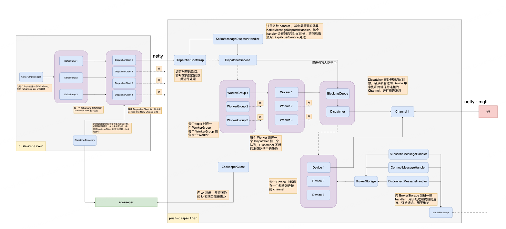

# MQTT 耗时分析

## 一、系统结构

> **Kafka → 内部分发调度 → 并发 worker → 队列 → Netty/MQTT 下发到终端**

这是一个**典型的"低延迟推送系统"**，时间主要不在计算，是花在**排队、切换、IO、背压**上。



### 性能指标

| 场景        | Kafka 到终端的端到端延迟 |
| --------- | --------------- |
| 正常负载      | **10 ~ 50 ms**  |
| 高峰期（P95）  | **50 ~ 200 ms**    |
| 极端峰值（P99） | **< 500 ms**    |
| > 1s      | 异常情况，需要报警    |

---

## 二、逐段分析时间

---

### 1. Kafka → KafkaPump → DispatcherClient（Receiver 服务）

**这里通常不会是主要瓶颈**，前提是配置合理。

#### 实现机制
* 异步并行分发（CompletableFuture）
* 智能backpressure控制
* 成功率监控与自适应

#### 合理耗时
* Kafka 拉取：**1 ~ 5 ms**
* 反序列化 + 封装：**< 1 ms** 
* 异步分发到多个Client：**< 2 ms**（并行执行）

**这一段整体 < 10 ms**

#### 优化效果
* **分发模式：** 串行阻塞 → 异步并行
* **P95延迟：** 500-2000ms → **50-200ms**
* **保护机制：** 成功率<50%时跳过25%消息


### 2. DispatcherClient → DispatcherBootstrap（Netty IO）

**内部网络传输，延迟可控**。

#### NIO传输时间分析

| 网络环境 | 预期延迟 | 说明 |
|---------|----------|------|
| 同机房内部 | **0.5 ~ 2 ms** | 局域网，最理想 |
| 同城跨机房 | **2 ~ 10 ms** | 专线连接 |
| 跨地域内网 | **20 ~ 50 ms** | 取决于物理距离 |
| 公网传输 | **50 ~ 200 ms** | 不推荐 |

#### 影响因素
* **网络带宽：** 1Gbps内网通常不是瓶颈
* **数据包大小：** Protobuf消息通常<64KB
* **TCP连接状态：** 长连接复用
* **网络拥塞：** 内网相对可控

### 3. DispatcherBootstrap → DispatcherService（Dispatcher 服务）

**接收处理，通常很快**。

#### 合理耗时
* 反序列化：**< 0.5 ms**（Protobuf高效）
* 路由决策：**< 0.5 ms**（内存查询）
* 投递到WorkerGroup：**< 1 ms**

**总体 < 2 ms**

#### 关键优化点
* 避免在接收线程做复杂业务逻辑
* 快速投递，异步处理
* 合理的线程池配置

### 4. Worker & BlockingQueue

**这里是最可能的性能瓶颈之一**。

#### 时间主要花在
* **排队等待：** BlockingQueue容量与消费速度
* **线程切换：** Worker线程调度开销
* **下游背压：** Channel写入受限时的反向影响

#### 合理耗时
* 入队 + 出队：**< 1 ms**
* 队列等待：**< 10 ms**（需要监控）
* Worker处理：**< 5 ms**

#### 性能调优要点

**队列容量配置：**
```yaml
worker:
  queueCapacity: 10000  # 根据消息大小调整
  corePoolSize: 8       # CPU核数
  maxPoolSize: 16       # 2倍CPU核数
```

**监控指标：**
* 队列深度（queue depth）
* Worker线程利用率
* 任务等待时间分布


### 5. Worker → Channel

#### 时间花在
* Channel健康检查（`isWritable()`）
* EventLoop排队调度
* 异步写入操作（`writeAndFlush`）

#### 合理耗时
* 单次 writeAndFlush：**< 0.5 ms**（异步立即返回）
* EventLoop 排队：**< 1 ms**（共享线程池）
* 总体：**0.5 ~ 2 ms**

#### 仍需注意的问题
* Channel不可写时的backpressure处理
* 异步写入的错误处理机制
* 热点设备的流量控制


### 6. Channel → 终端（MQTT传输）

**这一段基本无法控制，但可以预估**。

#### 网络延迟预期

| 网络类型 | 延迟范围 | 说明 |
|---------|----------|------|
| 同城WiFi | **5 ~ 30 ms** | 最理想情况 |
| 同城4G/5G | **10 ~ 50 ms** | 移动网络 |
| 跨地域网络 | **30 ~ 100 ms** | 物理距离限制 |
| 弱网环境 | **100 ~ 500 ms** | 网络抖动很大 |
